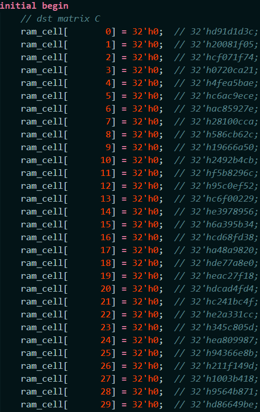
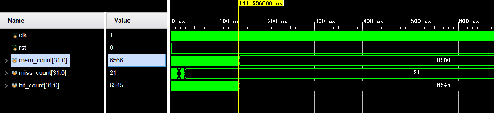
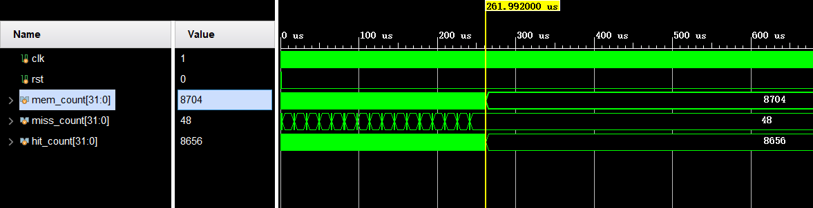
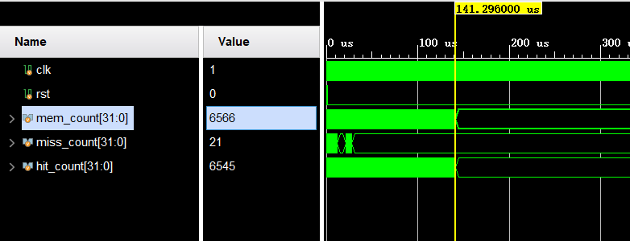

# 计算机体系结构 lab3 实验报告

> 肖桐 PB18000037

## 1. FIFO 多路组相联 Cache

假设组相联数为 `WAY_CNT`。

相比全相联的 Cache，不同点在于每个组的 line 个数多于 1。因此相应的 cache_mem、cache_tag、dirty、valid 域都得增加一个维度，大小为 `WAY_CNT`。同时对于每一个 line 需要一个 fifo 数组用来记录入队出队信息，用于 cache 替换。

因此有：

```verilog
reg [            31:0] cache_mem    [SET_SIZE][WAY_CNT][LINE_SIZE]; // SET_SIZE个line，每个line有LINE_SIZE个word
reg [TAG_ADDR_LEN-1:0] cache_tags   [SET_SIZE][WAY_CNT];            // SET_SIZE个TAG
reg                    valid        [SET_SIZE][WAY_CNT];            // SET_SIZE个valid(有效位)
reg                    dirty        [SET_SIZE][WAY_CNT];            // SET_SIZE个dirty(脏位)
reg [            31:0] fifo         [SET_SIZE][WAY_CNT];            // 记录 fifo 信息
```

而在对某一个 set 进行访问时，因为对于多路 Cache 而言，在同一个 set 内的 line 无法通过地址值确定，因此需要对所有的 line 都遍历一遍，比较每个 line 的 tag 域。然后返回命中的 line。

实现为：

```verilog
reg cache_hit = 1'b0;
always @ (*) begin              // 判断 输入的address 是否在 cache 中命中
    for (integer i = 0; i < WAY_CNT; i++) begin
        if (valid[set_addr][i] == 1'b1 && cache_tags[set_addr][i] == tag_addr) begin
            cache_hit = 1'b1;
            hit_way = i;
            break;
        end
        else begin
            cache_hit = 1'b0;
            hit_way = 0;
        end
    end
end
```

这里 `hit_way` 整数记录命中的 line 编号，用于从 Cache 中返回读取的字、或者向 Cache 中写入字：

```verilog
        case(cache_stat)
        IDLE:       begin
                        if(cache_hit) begin
                            if(rd_req) begin    // 如果cache命中，并且是读请求，
                                rd_data <= cache_mem[set_addr][hit_way][line_addr];   //则直接从cache中取出要读的数据
                            end else if(wr_req) begin // 如果cache命中，并且是写请求，
                                cache_mem[set_addr][hit_way][line_addr] <= wr_data;   // 则直接向cache中写入数据
                                dirty[set_addr][hit_way] <= 1'b1;                     // 写数据的同时置脏位
                            end
                        end
```

对于需要换入换出的情况，选取对应 set 中 fifo 值最小的 line 进行换入，同时对所有的 line，将 fifo 值减一。换入之后再将换入的 line 的 fifo 值置为最大 `WAY_CNT`。如下所示：

```verilog
							else begin
                            if(wr_req | rd_req) begin   // 如果 cache 未命中，并且有读写请求，则需要进行换入           // 上一个周期换入成功，这周期将主存读出的line写入cache，并更新tag，置高valid，置低dirty
                                static integer min = WAY_CNT;      // 找出 fifo 最小的 且 不脏的 line 换入
                                selected_way = hit_way;             // 若没有满足要求的 line, 则将换入到 hit_way 自身
                                for (integer i = 0; i < WAY_CNT; i++) begin
                                    if (valid[set_addr][i] == 1'b0) begin
                                        selected_way = i;
                                        break;
                                    end
                                    if (min > fifo[set_addr][i]) begin
                                        min = fifo[set_addr][i];
                                        selected_way = i;
                                    end
                                    fifo[set_addr][i] <= fifo[set_addr][i] - 1;   //队列递减
                                end
```

这里 `selected_way` 用于记录要被换入的 line 的编号，在 `SWAP_IN_OK` 状态下再实质上将来自 mem 的数据写入 cache 的该 line 中：

```verilog
        SWAP_IN_OK: begin
                        for(integer i=0; i<LINE_SIZE; i++)  cache_mem[mem_rd_set_addr][selected_way][i] <= mem_rd_line[i];
                        cache_tags[mem_rd_set_addr][selected_way] <= mem_rd_tag_addr;
                        valid     [mem_rd_set_addr][selected_way] <= 1'b1;
                        dirty     [mem_rd_set_addr][selected_way] <= 1'b0;
                        fifo      [mem_rd_set_addr][selected_way] <= WAY_CNT;  //置为最大
                        cache_stat <= IDLE;        // 回到就绪状态
                    end
```

换入之后同时将 dirty 置 0，valid 置 1。

## 2. LRU 多路组相联 Cache

LRU Cache 相比 FIFO Cache 只有换入换出时选择换入 line 的方式不同。LRU Cache 维护一个 lru 数组，与 FIFO Cache 目的类似，但是是在选择换入的 line 时选择 lru 值最小的 line。

同时每次 cache_hit 时都需要将 hit 的 line 的 lru 值重置为 0，以表示该 line 最近被使用过。同时需要将所有的其他 line 的 lru 值加一。

实现如下：

```verilog
        case(cache_stat)
        IDLE:       begin
                        if(cache_hit) begin
                            for (integer i = 0; i < WAY_CNT; i++) begin
                                lru[set_addr][i] = lru[set_addr][i] + 1;
                            end
                            lru[set_addr][hit_way] = 0;     //最近使用, lru 置为 0
                            if(rd_req) begin    // 如果cache命中，并且是读请求，
                                rd_data <= cache_mem[set_addr][hit_way][line_addr];   //则直接从cache中取出要读的数据
                            end else if(wr_req) begin // 如果cache命中，并且是写请求，
                                cache_mem[set_addr][hit_way][line_addr] <= wr_data;   // 则直接向cache中写入数据
                                dirty[set_addr][hit_way] <= 1'b1;                     // 写数据的同时置脏位
                            end
                        end
```

而在选择换入得块时与 FIFO Cache 操作是相同的，只不过此时是选择 lru 值最大的 line，实现如下：

```verilog
							else begin
                            if(wr_req | rd_req) begin   // 如果 cache 未命中，并且有读写请求，则需要进行换入           // 上一个周期换入成功，这周期将主存读出的line写入cache，并更新tag，置高valid，置低dirty
                                static integer max = 0;     // 找出 lru 最大的 且 不脏的 line 换入
                                selected_way = hit_way;     // 若没有满足要求的 line, 则将换入到 hit_way 自身
                                for (integer i = 0; i < WAY_CNT; i++) begin
                                    if (valid[set_addr][i] == 1'b0) begin
                                        selected_way = i;
                                        break;
                                    end
                                    if (max < lru[set_addr][i]) begin
                                        max = lru[set_addr][i];
                                        selected_way = i;
                                    end
                                end
```

这里 `selected_way` 用于记录要被换入的 line 的编号，在 `SWAP_IN_OK` 状态下再实质上将来自 mem 的数据写入 cache 的该 line 中：

```verilog
        SWAP_IN_OK: begin
                        for(integer i=0; i<LINE_SIZE; i++)  cache_mem[mem_rd_set_addr][selected_way][i] <= mem_rd_line[i];
                        cache_tags[mem_rd_set_addr][selected_way] <= mem_rd_tag_addr;
                        valid     [mem_rd_set_addr][selected_way] <= 1'b1;
                        dirty     [mem_rd_set_addr][selected_way] <= 1'b0;
                        lru       [mem_rd_set_addr][selected_way] <= 0;  //置为最小
                        cache_stat <= IDLE;        // 回到就绪状态
                    end
```

换入之后同时将 dirty 置 0，valid 置 1，同时将 lru 值置 0. 

## 3. 接入 CPU 后执行结果

选取 cache 大小为：

```verilog
    my_cache_FIFO #(
        .LINE_ADDR_LEN  ( 2             ),
        .SET_ADDR_LEN   ( 3             ),
        .TAG_ADDR_LEN   ( 5             ),
        .WAY_CNT        ( 4             )
    ) DCacheInst
    (
        .clk(clk),
        .rst(rst),
        .miss(DCacheMiss),
        .addr(A),
        .rd_req(MemReadM),
        .rd_data(RD_raw),
        .wr_req(|WE),
        .wr_data(WD)
    );
```

保证 `mem` 中有 1024 words，能够存下所有的矩阵元素和快排元素。

### (1). 矩阵乘法

执行 16 阶矩阵相乘，即每个矩阵的大小为 256 word。

#### (a). FIFO Cache

执行结果为：




左上为实际运行结果，右边是预期运行结果。下面是该次运行的 cache miss 和 cache hit 次数。

其中：`mem_count` 是一共的访存次数，`miss_count` 为 `cache miss` 次数，`hit_count` 为 `cache hit` 次数。

#### (b). LRU Cache

执行结果为：


左上为实际运行结果，右边是预期运行结果。下面是该次运行的 cache miss 和 cache hit 次数。

其中：`mem_count` 是一共的访存次数，`miss_count` 为 `cache miss` 次数，`hit_count` 为 `cache hit` 次数。

可见运行结果都满足预期。

### (2). 快速排序

执行 256 words 的快速排序。

#### (a). FIFO Cache

执行结果为：


上图为局部运行结果，下图为运行结束之后 Cache 中的值。易看出运行结果中局部无序的数据都在 cache 中。


上图为缺失率统计信息。

#### (b). LRU Cache

执行结果如下：


上图为局部运行结果，下图为运行结束之后 Cache 中的值。易看出运行结果中局部无序的数据都在 cache 中。


上图为缺失率统计信息。

## 4. 综合结果

### (1). FIFO Cache

```verilog
module my_cache_FIFO #(
    parameter  LINE_ADDR_LEN = 1, // line内地址长度，决定了每个line具有2^3个word
    parameter  SET_ADDR_LEN  = 2, // 组地址长度，决定了一共有2^3=8组
    parameter  TAG_ADDR_LEN  = 7, // tag长度
    parameter  WAY_CNT       = 2  // 组相连度，决定了每组中有多少路line，这里是直接映射型cache，因此该参数没用到
)(
    input  clk, rst,
    output miss,               // 对CPU发出的miss信号
    input  [31:0] addr,        // 读写请求地址
    input  rd_req,             // 读请求信号
    output reg [31:0] rd_data, // 读出的数据，一次读一个word
    input  wr_req,             // 写请求信号
    input  [31:0] wr_data      // 要写入的数据，一次写一个word
);
```


对于 `LINE_ADDR_LEN = 1, SET_ADDR_LEN = 2, TAG_ADDR_LEN = 7, WAY_CNT = 2` 的 FIFO Cache 而言，资源占用率如上图所示。

缺失率统计：

矩阵乘法：


快排：


```verilog
module my_cache_FIFO #(
    parameter  LINE_ADDR_LEN = 1, // line内地址长度，决定了每个line具有2^3个word
    parameter  SET_ADDR_LEN  = 2, // 组地址长度，决定了一共有2^3=8组
    parameter  TAG_ADDR_LEN  = 7, // tag长度
    parameter  WAY_CNT       = 4  // 组相连度，决定了每组中有多少路line，这里是直接映射型cache，因此该参数没用到
)(
    input  clk, rst,
    output miss,               // 对CPU发出的miss信号
    input  [31:0] addr,        // 读写请求地址
    input  rd_req,             // 读请求信号
    output reg [31:0] rd_data, // 读出的数据，一次读一个word
    input  wr_req,             // 写请求信号
    input  [31:0] wr_data      // 要写入的数据，一次写一个word
);
```


对于 `LINE_ADDR_LEN = 2, SET_ADDR_LEN = 3, TAG_ADDR_LEN = 5, WAY_CNT = 2` 的 FIFO Cache 而言，资源占用率如上图所示。

缺失率统计：

矩阵乘法：


快排：


```verilog
module my_cache_FIFO #(
    parameter  LINE_ADDR_LEN = 2, // line内地址长度，决定了每个line具有2^3个word
    parameter  SET_ADDR_LEN  = 3, // 组地址长度，决定了一共有2^3=8组
    parameter  TAG_ADDR_LEN  = 5, // tag长度
    parameter  WAY_CNT       = 2  // 组相连度，决定了每组中有多少路line，这里是直接映射型cache，因此该参数没用到
)(
    input  clk, rst,
    output miss,               // 对CPU发出的miss信号
    input  [31:0] addr,        // 读写请求地址
    input  rd_req,             // 读请求信号
    output reg [31:0] rd_data, // 读出的数据，一次读一个word
    input  wr_req,             // 写请求信号
    input  [31:0] wr_data      // 要写入的数据，一次写一个word
);
```


对于 `LINE_ADDR_LEN = 2, SET_ADDR_LEN = 3, TAG_ADDR_LEN = 5, WAY_CNT = 4` 的 FIFO Cache 而言，资源占用率如上图所示。

缺失率统计：

矩阵乘法：


快排：


```verilog
module my_cache_FIFO #(
    parameter  LINE_ADDR_LEN = 2, // line内地址长度，决定了每个line具有2^3个word
    parameter  SET_ADDR_LEN  = 3, // 组地址长度，决定了一共有2^3=8组
    parameter  TAG_ADDR_LEN  = 5, // tag长度
    parameter  WAY_CNT       = 4  // 组相连度，决定了每组中有多少路line，这里是直接映射型cache，因此该参数没用到
)(
    input  clk, rst,
    output miss,               // 对CPU发出的miss信号
    input  [31:0] addr,        // 读写请求地址
    input  rd_req,             // 读请求信号
    output reg [31:0] rd_data, // 读出的数据，一次读一个word
    input  wr_req,             // 写请求信号
    input  [31:0] wr_data      // 要写入的数据，一次写一个word
);
```


对于 `LINE_ADDR_LEN = 2, SET_ADDR_LEN = 3, TAG_ADDR_LEN = 5, WAY_CNT = 2` 的 FIFO Cache 而言，资源占用率如上图所示。

```verilog
module my_cache_FIFO #(
    parameter  LINE_ADDR_LEN = 2, // line内地址长度，决定了每个line具有2^3个word
    parameter  SET_ADDR_LEN  = 3, // 组地址长度，决定了一共有2^3=8组
    parameter  TAG_ADDR_LEN  = 5, // tag长度
    parameter  WAY_CNT       = 4  // 组相连度，决定了每组中有多少路line，这里是直接映射型cache，因此该参数没用到
)(
    input  clk, rst,
    output miss,               // 对CPU发出的miss信号
    input  [31:0] addr,        // 读写请求地址
    input  rd_req,             // 读请求信号
    output reg [31:0] rd_data, // 读出的数据，一次读一个word
    input  wr_req,             // 写请求信号
    input  [31:0] wr_data      // 要写入的数据，一次写一个word
);
```


对于 `LINE_ADDR_LEN = 2, SET_ADDR_LEN = 3, TAG_ADDR_LEN = 5, WAY_CNT = 4` 的 FIFO Cache 而言，资源占用率如上图所示。

缺失率统计：

矩阵乘法：


快排：


```verilog
module my_cache_FIFO #(
    parameter  LINE_ADDR_LEN = 4, // line内地址长度，决定了每个line具有2^3个word
    parameter  SET_ADDR_LEN  = 4, // 组地址长度，决定了一共有2^3=8组
    parameter  TAG_ADDR_LEN  = 2, // tag长度
    parameter  WAY_CNT       = 2  // 组相连度，决定了每组中有多少路line，这里是直接映射型cache，因此该参数没用到
)(
    input  clk, rst,
    output miss,               // 对CPU发出的miss信号
    input  [31:0] addr,        // 读写请求地址
    input  rd_req,             // 读请求信号
    output reg [31:0] rd_data, // 读出的数据，一次读一个word
    input  wr_req,             // 写请求信号
    input  [31:0] wr_data      // 要写入的数据，一次写一个word
);
```


对于 `LINE_ADDR_LEN = 4, SET_ADDR_LEN = 4, TAG_ADDR_LEN = 2, WAY_CNT = 2` 的 FIFO Cache 而言，资源占用率如上图所示。

缺失率统计：

矩阵乘法：


快排：



```verilog
module my_cache_FIFO #(
    parameter  LINE_ADDR_LEN = 4, // line内地址长度，决定了每个line具有2^3个word
    parameter  SET_ADDR_LEN  = 4, // 组地址长度，决定了一共有2^3=8组
    parameter  TAG_ADDR_LEN  = 2, // tag长度
    parameter  WAY_CNT       = 4  // 组相连度，决定了每组中有多少路line，这里是直接映射型cache，因此该参数没用到
)(
    input  clk, rst,
    output miss,               // 对CPU发出的miss信号
    input  [31:0] addr,        // 读写请求地址
    input  rd_req,             // 读请求信号
    output reg [31:0] rd_data, // 读出的数据，一次读一个word
    input  wr_req,             // 写请求信号
    input  [31:0] wr_data      // 要写入的数据，一次写一个word
);
```


对于 `LINE_ADDR_LEN = 4, SET_ADDR_LEN = 4, TAG_ADDR_LEN = 2, WAY_CNT = 4` 的 FIFO Cache 而言，资源占用率如上图所示。

缺失率统计：

矩阵乘法：


快排：


### (2). LRU Cache

```verilog
module my_cache_LRU #(
    parameter  LINE_ADDR_LEN = 1, // line内地址长度，决定了每个line具有2^3个word
    parameter  SET_ADDR_LEN  = 2, // 组地址长度，决定了一共有2^3=8组
    parameter  TAG_ADDR_LEN  = 7, // tag长度
    parameter  WAY_CNT       = 2  // 组相连度，决定了每组中有多少路line，这里是直接映射型cache，因此该参数没用到
)(
    input  clk, rst,
    output miss,               // 对CPU发出的miss信号
    input  [31:0] addr,        // 读写请求地址
    input  rd_req,             // 读请求信号
    output reg [31:0] rd_data, // 读出的数据，一次读一个word
    input  wr_req,             // 写请求信号
    input  [31:0] wr_data      // 要写入的数据，一次写一个word
);
```


对于 `LINE_ADDR_LEN = 1, SET_ADDR_LEN = 2, TAG_ADDR_LEN = 7, WAY_CNT = 2` 的 LRU Cache 而言，资源占用率如上图所示。

缺失率统计：

矩阵乘法：


快排：


```verilog
module my_cache_LRU #(
    parameter  LINE_ADDR_LEN = 1, // line内地址长度，决定了每个line具有2^3个word
    parameter  SET_ADDR_LEN  = 2, // 组地址长度，决定了一共有2^3=8组
    parameter  TAG_ADDR_LEN  = 7, // tag长度
    parameter  WAY_CNT       = 4  // 组相连度，决定了每组中有多少路line，这里是直接映射型cache，因此该参数没用到
)(
    input  clk, rst,
    output miss,               // 对CPU发出的miss信号
    input  [31:0] addr,        // 读写请求地址
    input  rd_req,             // 读请求信号
    output reg [31:0] rd_data, // 读出的数据，一次读一个word
    input  wr_req,             // 写请求信号
    input  [31:0] wr_data      // 要写入的数据，一次写一个word
);
```


对于 `LINE_ADDR_LEN = 1, SET_ADDR_LEN = 2, TAG_ADDR_LEN = 7, WAY_CNT = 4` 的 LRU Cache 而言，资源占用率如上图所示。

缺失率统计：

矩阵乘法：


快排：


```verilog
module my_cache_LRU #(
    parameter  LINE_ADDR_LEN = 2, // line内地址长度，决定了每个line具有2^3个word
    parameter  SET_ADDR_LEN  = 3, // 组地址长度，决定了一共有2^3=8组
    parameter  TAG_ADDR_LEN  = 5, // tag长度
    parameter  WAY_CNT       = 2  // 组相连度，决定了每组中有多少路line，这里是直接映射型cache，因此该参数没用到
)(
    input  clk, rst,
    output miss,               // 对CPU发出的miss信号
    input  [31:0] addr,        // 读写请求地址
    input  rd_req,             // 读请求信号
    output reg [31:0] rd_data, // 读出的数据，一次读一个word
    input  wr_req,             // 写请求信号
    input  [31:0] wr_data      // 要写入的数据，一次写一个word
);
```


对于 `LINE_ADDR_LEN = 2, SET_ADDR_LEN = 3, TAG_ADDR_LEN = 5, WAY_CNT = 2` 的 LRU Cache 而言，资源占用率如上图所示。

缺失率统计：

矩阵乘法：


快排：


```verilog
module my_cache_LRU #(
    parameter  LINE_ADDR_LEN = 2, // line内地址长度，决定了每个line具有2^3个word
    parameter  SET_ADDR_LEN  = 3, // 组地址长度，决定了一共有2^3=8组
    parameter  TAG_ADDR_LEN  = 5, // tag长度
    parameter  WAY_CNT       = 4  // 组相连度，决定了每组中有多少路line，这里是直接映射型cache，因此该参数没用到
)(
    input  clk, rst,
    output miss,               // 对CPU发出的miss信号
    input  [31:0] addr,        // 读写请求地址
    input  rd_req,             // 读请求信号
    output reg [31:0] rd_data, // 读出的数据，一次读一个word
    input  wr_req,             // 写请求信号
    input  [31:0] wr_data      // 要写入的数据，一次写一个word
);
```


对于 `LINE_ADDR_LEN = 2, SET_ADDR_LEN = 3, TAG_ADDR_LEN = 5, WAY_CNT = 4` 的 LRU Cache 而言，资源占用率如上图所示。

缺失率统计：

矩阵乘法：


快排：


```verilog
module my_cache_LRU #(
    parameter  LINE_ADDR_LEN = 4, // line内地址长度，决定了每个line具有2^3个word
    parameter  SET_ADDR_LEN  = 4, // 组地址长度，决定了一共有2^3=8组
    parameter  TAG_ADDR_LEN  = 2, // tag长度
    parameter  WAY_CNT       = 2  // 组相连度，决定了每组中有多少路line，这里是直接映射型cache，因此该参数没用到
)(
    input  clk, rst,
    output miss,               // 对CPU发出的miss信号
    input  [31:0] addr,        // 读写请求地址
    input  rd_req,             // 读请求信号
    output reg [31:0] rd_data, // 读出的数据，一次读一个word
    input  wr_req,             // 写请求信号
    input  [31:0] wr_data      // 要写入的数据，一次写一个word
);
```


对于 `LINE_ADDR_LEN = 4, SET_ADDR_LEN = 4, TAG_ADDR_LEN = 2, WAY_CNT = 2` 的 LRU Cache 而言，资源占用率如上图所示。

缺失率统计：

矩阵乘法：


快排：


```verilog
module my_cache_LRU #(
    parameter  LINE_ADDR_LEN = 4, // line内地址长度，决定了每个line具有2^3个word
    parameter  SET_ADDR_LEN  = 4, // 组地址长度，决定了一共有2^3=8组
    parameter  TAG_ADDR_LEN  = 2, // tag长度
    parameter  WAY_CNT       = 4  // 组相连度，决定了每组中有多少路line，这里是直接映射型cache，因此该参数没用到
)(
    input  clk, rst,
    output miss,               // 对CPU发出的miss信号
    input  [31:0] addr,        // 读写请求地址
    input  rd_req,             // 读请求信号
    output reg [31:0] rd_data, // 读出的数据，一次读一个word
    input  wr_req,             // 写请求信号
    input  [31:0] wr_data      // 要写入的数据，一次写一个word
);
```


对于 `LINE_ADDR_LEN = 4, SET_ADDR_LEN = 4, TAG_ADDR_LEN = 2, WAY_CNT = 4` 的 LRU Cache 而言，资源占用率如上图所示。

缺失率统计：

矩阵乘法：



快排：


