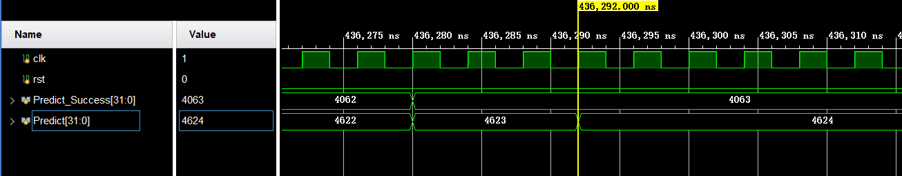

# CA Lab4 报告

> 肖桐 PB18000037

## 1. BTB 实现

BTB 实现需要维护一个 BTB 表：

```verilog
reg [64:0] BTB [0:BTB_SIZE - 1]
```

每个 entry 65位。

其中最高位是有效位，当且仅当该有效位置 1 时才会在分支预测中使用该条目的值。

63-32 位共 32 位，是用于与 PCF 进行比对，充当 tag 的作用，若匹配成功，则取 31-0 位为预测地址，作为下一个 PCF 值。

31-0 位共 32 位为预测地址。

BTB 判断是否命中使用两个条件：

1. 有效位为 1
2. PCF 与 63-32 位相同

若都满足则预测跳转，代码实现如下：

```verilog
assign PCF_addr = {PCF[BTB_ADDR_LEN - 1:0]};
assign PCE_addr = {PCE[BTB_ADDR_LEN - 1:0]};

always @(*) begin
    if (rst) begin
        BTB_HitF = 1'b0;
    end
    else begin
        if (BTB[PCF_addr][64] == 1'b1 && PCF == BTB[PCF_addr][63:32]) begin
            BTB_HitF = 1'b1;
        end
        else begin
            BTB_HitF = 1'b0;
        end
    end
end

assign PredictPC = (BTB_HitF & BHT_HitF) ? BTB[PCF_addr][31:0] : 32'dx;
```

BTB 更新有两种情况：

1. 预测不跳转但是实际上需要跳转

   此时需要将 BTB 中对应的条目改为有效，同时 63-32 位更新为该跳转指令的 PC，31-0 位更新为预测跳转地址。

2. 预测跳转但是实际上不跳转

   此时只需要将 BTB 中对应条目的有效位置 0 即可，表示该条目无效， 此时尽管 PCF 对比命中也不再跳转。

代码实现如下：

```verilog
always @(posedge clk or posedge rst) begin
    if (rst) begin
        for (integer i = 0; i < BTB_SIZE; i++) begin
            BTB[i] <= 65'd0;
        end
    end
    else begin
        if (we) begin
            BTB[PCE_addr] <= {1'b1, PCE, BrNPC};
        end
        else if (clear) begin
            BTB[PCE_addr][64] <= 1'b0;
        end
    end
end
```

其中 we 和 clear 为：

```verilog
assign we = (BranchE & ~BTB_HitE);
assign clear = (~BranchE & BTB_HitE & BrInstE);
```


## 2. BHT 实现

BHT 在 BTB 基础上实现。

即对每一个 BTB 条目，配一个 2bits 宽的 BHT 条目。

当且仅当一个 Branch 指令跳转成功时，即 BranchE = 1'b1 时，对应的 BHT 条目 +1，否则对应的 BHT 条目 - 1。

实现代码如下：

```verilog
always @(posedge clk or posedge rst) begin
    if (rst) begin
        for (integer i = 0; i < BTB_SIZE; i++) begin
            BHT[i] <= 2'b11;
        end
    end
    else begin
        case (BHT[PCF_addr])
        2'b00:
        begin
            if (~BranchE & BrInstE) begin
                BHT[PCF_addr] <= 2'b00;
            end
            else if (BranchE & BrInstE) begin
                BHT[PCF_addr] <= 2'b01;
            end
            else begin
                BHT[PCF_addr] <= 2'b00;
            end
        end
        2'b01:
        begin
            if (~BranchE & BrInstE) begin
                BHT[PCF_addr] <= 2'b00;
            end
            else if (BranchE & BrInstE) begin
                BHT[PCF_addr] <= 2'b10;
            end
            else begin
                BHT[PCF_addr] <= 2'b01;
            end
        end
        2'b10:
        begin
            if (~BranchE & BrInstE) begin
                BHT[PCF_addr] <= 2'b01;
            end
            else if (BranchE & BrInstE) begin
                BHT[PCF_addr] <= 2'b11;
            end
            else begin
                BHT[PCF_addr] <= 2'b10;
            end
        end
        2'b11:
        begin
            if (~BranchE & BrInstE) begin
                BHT[PCF_addr] <= 2'b10;
            end
            else if (BranchE & BrInstE) begin
                BHT[PCF_addr] <= 2'b11;
            end
            else begin
                BHT[PCF_addr] <= 2'b11;
            end
        end
        default:
        begin
            BHT[PCF_addr] <= 2'b11;
        end
        endcase
    end
end
```

而 BHT 是否命中只看对应的 BHT entry 高位是否为 1，实现代码如下：

```verilog
assign BHT_HitF = BHT[PCF_addr][1];
```

## 3. 数据通路

以上是 BHT 和 BTB 模块的实现，要使该模块能在 CPU 中发挥作用，还需要将 CPU 的数据通路进行修改。

### (1). NPC_Generator

首先需要改该模块。

当 BHT 和 BTB 预测成功时，则 NPC 为来自 BTB 的 PredictPC。否则为 PCF + 4。

但是根据 CPU 的执行逻辑，来自 ID 和 EX 段的跳转指令优先级仍比预测地址高，因此修改模块如下：

```verilog
module NPC_Generator(
    input wire [31:0] PCF, PCE, JalrTarget, BranchTarget, JalTarget, PredictPC,
    input wire BranchE,JalD,JalrE,BTB_HitF,BTB_HitE,BHT_HitF,BHT_HitE,BrInstE,
    output reg [31:0] PC_In
    );

    always @(*)
    begin
        if (JalrE)
            PC_In = JalrTarget;
        else if (BranchE & ~(BHT_HitE & BTB_HitE))         //BTB 未命中 或 BHT 为 0, 表示在 IF 段未跳转, 因此在此时需要 Branch
            PC_In = BranchTarget;
        else if (~BranchE & (BTB_HitE & BHT_HitE) & BrInstE)
            PC_In = PCE + 4;
        else if (JalD)
            PC_In = JalTarget;
        else if (BTB_HitF & BHT_HitF)       //仅当 BTB 命中且 BHT 为 1 时才预测
            PC_In = PredictPC;
        else
            PC_In = PCF + 4;
    end

endmodule
```

这里若 Branch 指令实际上不分支但是预测分支了，则需要将 PC 重置为 PCE + 4。因为在 PCE 之后的两条指令都是无效的，需要清空。

### (2). HazardUnit

如上所述，当 Branch 指令实际上不分支但是预测分支了也需要清空 IF 和 ID 段的指令。因此将 HazardUnit 中清空 IF 和 ID 段的控制逻辑更改如下：

```verilog
assign Branch_Flush = (BranchE & ~(BTB_HitE & BHT_HitE)) | (~BranchE & (BTB_HitE & BHT_HitE) & BrInstE);
```

当且仅当 Branch_Flush = 1'b1 时，清空 IF、ID 段。

### (3). RV32ICore

需要在总控模块中将线连起来，同时因为预测功能的实现，需要将 Hit 信息从 IF 段传到 EX 段。

## 4. 结果展示

### (1). 分支收益

分支预测成功的话则没有分支延迟槽，因此没有代价，或者说收益是 -2。

若分支预测失败或者没有分支预测时分支代价为 2，或者说收益是 0。

### (2). QuickSort


上图为无 BTB 和 BHT 时的运行时间和 Branch 指令个数。


其中总 Branch 指令数为 8020 条，分支预测成功条数为 6284条。则分支预测错误次数为 8020 - 6284 = 1736 条。

根据上面的分析，若不适用分支预测，则在 Branch 指令处需要额外消耗 $8020 \times 2 = 16040$ 个周期，而使用分支预测之后，在 Branch 指令处需要额外消耗 $1736 \times 2 = 3472$ 个周期。

### (3). MatMul

结果如下：


上图为无 BTB 和 BHT 时的运行时间和 Branch 指令个数。



其中总 Branch 指令数为 4624 条，分支预测成功条数为 4063 条。则分支预测错误次数为 4624 - 4063 = 561 条。

根据上面的分析，若不适用分支预测，则在 Branch 指令处需要额外消耗 $4624 \times 2 = 9248$ 个周期，而使用分支预测之后，在 Branch 指令处需要额外消耗 $561 \times 2 = 1122$ 个周期。

### (4). BHT 测试样例

结果如下：


其中总 Branch 指令数为 110 条，分支预测成功条数为 88 条。则分支预测错误次数为 110 - 88 = 22 条。

根据上面的分析，若不适用分支预测，则在 Branch 指令处需要额外消耗 $110 \times 2 = 220$ 个周期，而使用分支预测之后，在 Branch 指令处需要额外消耗 $22 \times 2 = 44$ 个周期。

### (5). BTB 测试样例

仿真结果为：


其中总 Branch 指令数为 101 条，分支预测成功条数为 99 条。则分支预测错误次数为 101 - 99 = 2 条。

根据上面的分析，若不适用分支预测，则在 Branch 指令处需要额外消耗 $101 \times 2 = 202$ 个周期，而使用分支预测之后，在 Branch 指令处需要额外消耗 $2 \times 2 = 4$ 个周期。

### (6). 对比关系

根据仿真结果可见，显然有 BTB 和 BHT 的运行时间少了很多。而且分支预测的成功率很高，能够有效地减少 Branch 指令带来的流水线惩罚。
