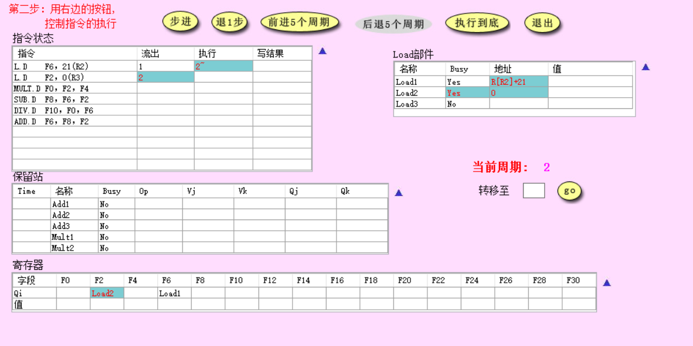
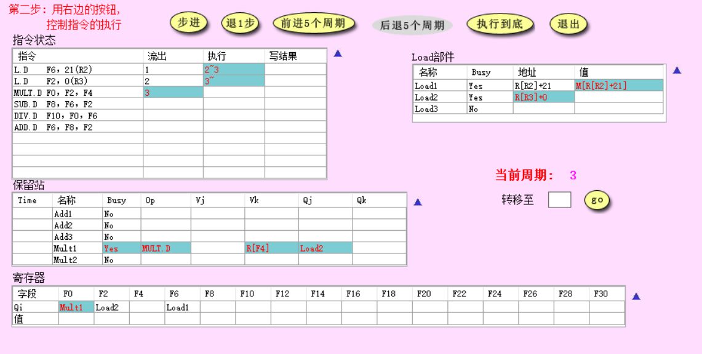
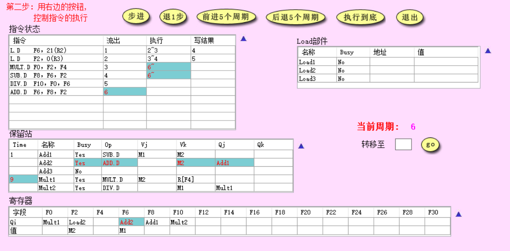
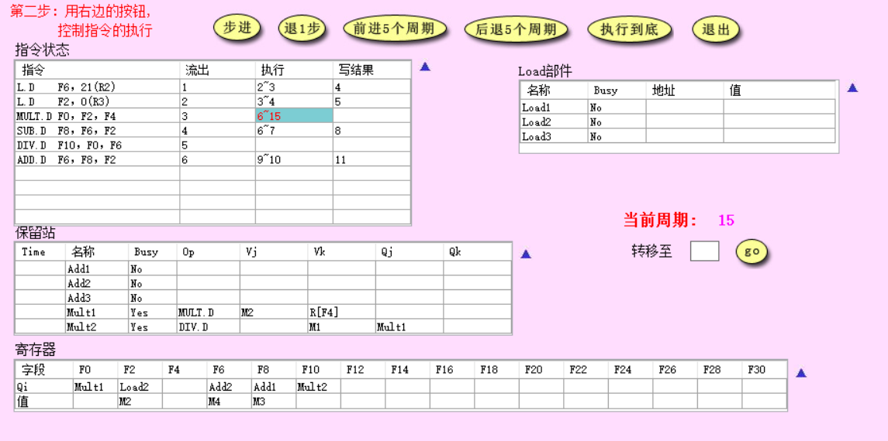
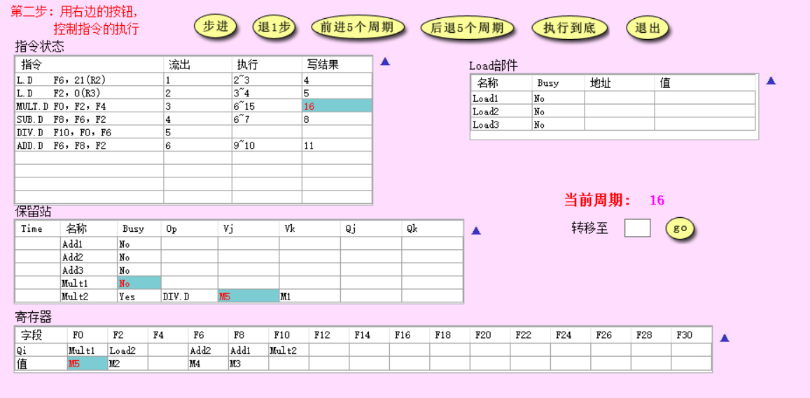
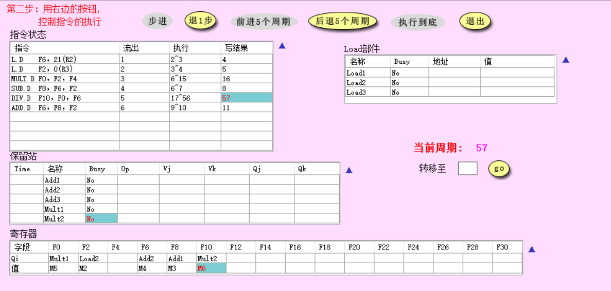
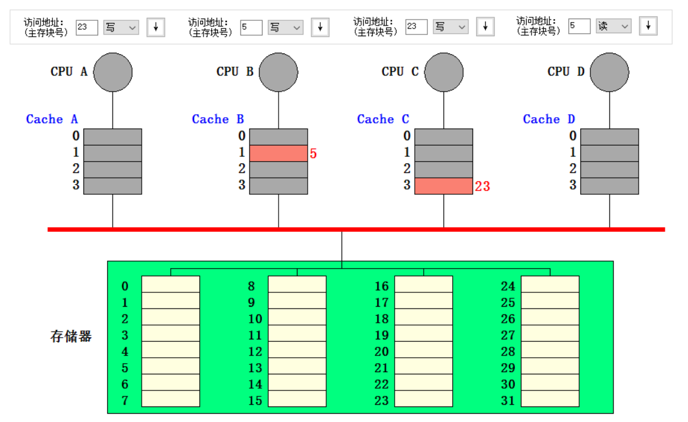
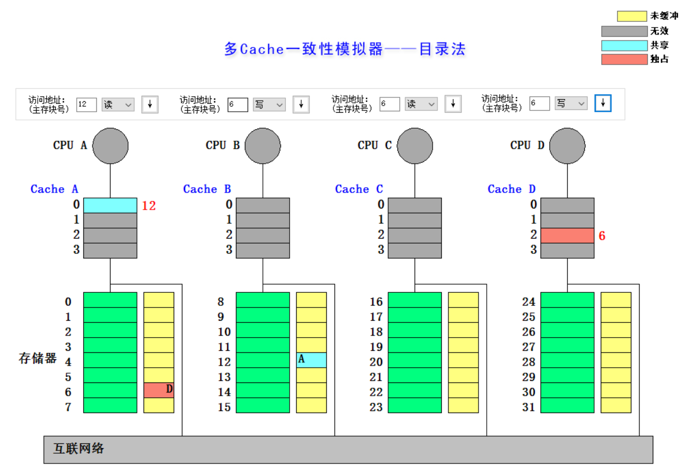

# CA Lab5

> 肖桐 PB18000037

# 一. Tomasulo算法模拟器

## 1. 截图当前周期2和当前周期3

Load 部件改动：Load1 从存储器中取值，Load2 计算出来访存地址。

## 2. 截图 MUL.D 刚开始执行时系统状态

改动：改动即为图中红色字体

- 指令 `ADD.D F6, F8, F2 ` 发射

- 指令 `MULT.D F0, F2, F4 ` 开始执行
- 指令 `SUB.D F8, F6, F2` 开始执行
- 指令 `L.D F2, 0(R3)` 写回完成
- 保留站 Mult1 部件的 Time 变为 9
- 保留站 Add2 部件 Busy 变为 Yes，Op 为 ADD.D，Vk 为 M2 ， Qj 为 Add1
- 寄存器 F6 从 Load1 变成 Add2，busy 变为 Yes

## 3. 简要说明是什么相关导致MUL.D流出后没有立即执行

因为 `L.D F2, 0(R3)` 和 `MULT.D F0, F2, F4` 存在 RAW 相关。

## 4. 截图周期15和周期16

区别就是图中红色字体所显示的：

- 指令 ` MULT.D F0, F2, F4` 写回完成
- 保留站 Mult1 部件 Buzy 字段变为 No
- Mult2 部件 Vj 变为 M5
- 寄存器中 F0 写⼊ M5

## 5.

在第 57 周期结束。截图如下：

# 二. 多cache一致性算法-监听法

## 1. 利用模拟器进行下述操作，并填写下表

|  所进行的访问  | 是否发生了替换？ | 是否发生了写回？ |                监听协议进行的操作与块状态改变                |
| :------------: | :--------------: | :--------------: | :----------------------------------------------------------: |
| CPU A 读第5块  |        否        |        否        |     第5块从存储器加载进入 CPU A 的 Cache 中，状态为共享      |
| CPU B 读第5块  |        否        |        否        |     第5块从存储器加载进入 CPU B 的 Cache 中，状态为共享      |
| CPU C 读第5块  |        否        |        否        |     第5块从存储器加载进入 CPU C 的 Cache 中，状态为共享      |
| CPU B 写第5块  |        否        |        否        | 写命中 CPU B Cache 第一块，总线发出作废信号，CPU A 与 CPU C cache 第一块作废，状态改为独占 |
| CPU D 读第5块  |        否        |        是        | B 将 Cache 第一块写回存储器第五块，然后 D 从存储器中读第五块，这两块的状态变为共享 |
| CPU B 写第21块 |        是        |        否        | B 从存储器中读第 21 块到 Cache 中，放在 Cache 第一块中，覆盖原来的第 5 块，状态为独占 |
| CPU A 写第23块 |        否        |        否        | A 从存储器中读第 23 块到 Cache 第三块中，写操作后状态为独占  |
| CPU C 写第23块 |        否        |        是        | A 将第 23 块写回存储器，Cache 第三块状态改为无效，然后 C 从存储器中读第 23 块，存到 Cache 第三块中，然后写操作，状态改为独占 |
| CPU B 读第29块 |        是        |        是        | B 先将第 21 块写回存储器，然后将第 29 块加载进入 Cache 第一块中，状态改为共享 |
| CPU B 写第5块  |        是        |        否        | B 从存储器中读第五块，加载到 Cache 第一块，覆盖第 29 块，执行写操作，状态改为独占。同时 D 中的第五块状态改为无效。 |

## 2. 请截图，展示执行完以上操作后整个cache系统的状态

# 三. 多cache一致性算法-目录法

## 1. 利用模拟器进行下述操作，并填写下表

|  所进行的访问  |                监听协议进行的操作与块状态改变                |
| :------------: | :----------------------------------------------------------: |
| CPU A 读第6块  | A 读 Cache 第 2 块不命中，向宿主存储器发送访问请求，宿主把数据块传给 A Cache 第2块，共享集合设为 A |
| CPU B 读第6块  | B 读 Cache 第 2 块不命中，通过互联网络向 A 对应的存储器发送访问请求，A 存储器把数据块传给 B Cache 第2块，共享集合设为 A、B |
| CPU D 读第6块  | D 读 Cache 第 2 块不命中，通过互联网络向 A 对应的存储器发送访问请求，A 存储器把数据块传给 D Cache 第2块，共享集合设为 A、B、D |
| CPU B 写第6块  | B 写 Cache 命中，通过互联网络向 A 对应的存储器发送写命中信号，状态改为 B 独占，A 存储器向 A 和 D 发送作废信号，A、D Cache 中的块状态改为无效 |
| CPU C 读第6块  | C 向 A 存储器发出访问请求，然后 B 将 Cache 中的块写回到 A 存储器中，A 存储器再将该块通过互联网络传递给 C Cache。A 存储器共享集合设为 B、C，B、C Cache 中状态改为共享 |
| CPU D 写第20块 | D 写 Cache 不命中，向 C 存储器发出写不命中信号，C 存储器将第 20 块传递给 D，存储器状态改为 D 独占，D Cache 状态设置为独占 |
| CPU A 写第20块 | A Cache 写第0块不命中，向C 存储器第 20 块发送写不命中信号， C 向 D Cache 第 0 块发送取并作废消息，D 把数据块送给C 同时把D Cache 第 0 块作废，C 把数据块送给A Cache 第 0 块，共享集合设为 A ， CPU A 写 Cache 的第 0 块 |
| CPU D 写第6块  | D Cache写第 2 块不命中，向A 存储器第 6 块发送写不命中信号， A 向 B Cache 第 2 块与 C Cache 第 2 块发送作废消息，B 把数据块送给 A 并将 D Cache 第 0 块作废，A 把数据块送给 Cache 第 2 块，共享集合设为D ，D 写⼊ Cache 第 2 块 |
| CPU A 读第12块 | A Cache 第 0 块读不命中，向被替换块的 C 存储器第 20 块发送写回并修改共享集信号，再向 B 存储器第 12 块发送读不命中信号，B 把数据块送给 A Cache 第 0 块，共享集合设为 A |

## 2. 请截图，展示执行完以上操作后整个cache系统的状态

# 四、综合问答

## 1. 目录法和监听法分别是集中式和基于总线，两者优劣是什么？

1. 监听法在核数较少时，总线压力较小，因此效果比较好，但是当核数增多，各 CPU 之间访问冲突增加，从而总线冲突增加，因此效果下降。

2. 目录法使用集中目录来记录 Cache 的状态，总线压力小，但是随着核数增加时目录的开销变大。

## 2. Tomasulo算法相比Score Board算法有什么异同？（简要回答两点：1.分别解决了什么相关，2.分别是分布式还是集中式）
区别在于 Tomasulo 解决 WAW 和 WAR 相关的办法是寄存器重命名，但是 Score Board 算法解决这两个相关的方法是等待。

Tomasulo 是分布式，Score Board 是集中式。

## 3.  Tomasulo算法是如何解决结构、RAW、WAR和WAW相关的？

RAW：Tomasulo跟踪每个源操作数，仅当所有源操作数可用时才发射指令。

WAR，WAW：Tomasulo使用寄存器重命名技术解决WAR和WAW，通过保留站来实现。
